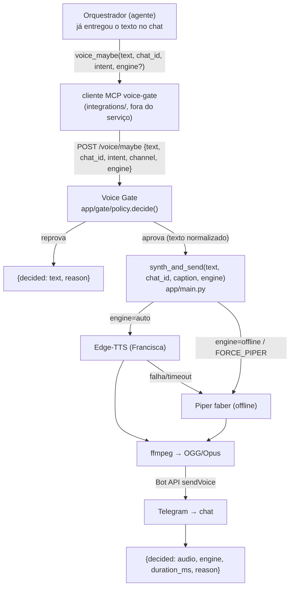

# Arquitetura — LunaSpeak

LunaSpeak é o microserviço de **TTS** do assistente: recebe texto, decide se cabe
áudio, sintetiza voz pt-BR e entrega como **voice message** no Telegram. Este
documento explica o **porquê** das decisões e os trade-offs — não só o quê. Para
o *como rodar* veja o `README.md`; para *deploy* veja `deploy.md`.

## Princípio central: online = conveniência, offline = resiliência

O sistema tem **duas engines** com papéis deliberadamente distintos:

- **Edge-TTS (Francisca)** — voz feminina natural, gratuita, mas **online** (bate
  no servidor da Microsoft). É a voz **padrão** porque a qualidade é melhor.
- **Piper (`pt_BR-faber-medium`)** — voz masculina, **100% local/offline**, rápida
  (~1s). É a **rede de segurança**.

A decisão de design: **o fallback Edge→Piper dispara por FALHA/timeout, não por
demora**. Se o Edge responde, usamos o Edge (melhor voz); se ele falha (rede,
403, timeout `EDGE_TIMEOUT`), caímos pro Piper — que **sempre** funciona. O
resultado é que o serviço **nunca deixa de entregar áudio** por causa da rede,
sem sacrificar a qualidade no caminho feliz. O `engine=offline` (ver abaixo) é um
atalho **explícito** pra esse mesmo Piper, pedido pelo chamador — distinto do
fallback-por-falha.

## Fluxo de dados ponta a ponta

O orquestrador (o agente que fala com o usuário) já entregou o **texto** pelo seu
próprio canal. O áudio é **camada opcional**: nunca é o caminho crítico da
resposta. O contrato de cada hop:

Chamadas diretas ao `POST /say` (sem passar pelo gate) seguem do hop
`synth_and_send` em diante — o `/say` é o núcleo reusável; o `/voice/maybe` é o
`/say` **precedido** pela decisão de política.

## Fronteiras de módulo (e a razão delas)

| Camada | Arquivo | Responsabilidade | Regra |
|---|---|---|---|
| **Política** | `app/gate/` (`policy.py`, `normalize.py`) | Decide *se* cabe áudio e normaliza o texto falável | **LÓGICA PURA, sem I/O** — nenhuma rede, nenhum subprocess. Testável isolado; extraível como domínio próprio |
| **Serviço/I/O** | `app/main.py` | Rotas HTTP, síntese (Edge/Piper via subprocess), ffmpeg, `sendVoice` | Todo o I/O mora aqui. `synth_and_send` é o núcleo reusável |
| **Orquestrador** | `integrations/kiro-mcp/` | Cliente MCP que o agente usa pra chamar o gate no seu turno | **Wrapper fino, sem estado, sem política.** Vive "fora" do serviço conceitualmente |

Por que a política é pura: a decisão "cabe áudio?" é a parte que mais muda e mais
precisa de teste. Mantê-la sem I/O torna-a determinística (entra texto+intent, sai
`Decision`) e permite, no futuro, promovê-la a um serviço próprio sem arrastar o
TTS junto.

## Os três eixos ORTOGONAIS do gate

Uma resposta de áudio é governada por três perguntas **independentes**. Confundir
uma com a outra é o erro clássico:

1. **SE fala** — *ativação*. `app/gate/policy.decide()`: porta A (intenção:
   `explicit` do usuário, ou `auto` conversacional) **AND** porta B (elegibilidade:
   sem código/tabela via `has_structural_content`, canal suportado, não-vazio após
   normalizar).
2. **QUANTO fala** — *limite de tamanho*. `SAY_MAX_CHARS` (fonte única, ver abaixo).
   O gate reprova `too_long` **antes** de sintetizar; o `/say` revalida o mesmo teto
   como defesa em profundidade.
3. **QUAL engine** — `engine=auto|offline`. Só escolhe **qual** engine sintetiza,
   **nunca** *se* sintetiza.

Cada eixo tem seu próprio ponto de controle e nenhum interfere no outro.

## Trade-offs assumidos

- **Serviço STATELESS.** Não guarda sessão, modo, nem histórico. O "modo offline"
  sticky (liga até desligar) é estado do **orquestrador**, que passa `engine=offline`
  em cada request. Consequência boa: o serviço escala/reinicia sem perder estado;
  consequência a lembrar: quem chama é responsável por manter o modo.
- **Fonte única do limite.** `SAY_MAX_CHARS` é lido **só** em `app/main.py` e passado
  ao gate como parâmetro `max_chars`. Não há um segundo limite no gate — evita as
  duas fontes divergirem.
- **Fallback sempre entrega — ou texto, ou áudio, nunca erro pro orquestrador.** No
  `/voice/maybe`, se a síntese falha depois de aprovada, o gate absorve e devolve
  `{decided:"text", reason:"service_down"}`: um único ponto de falha, previsível, pro
  chamador. O áudio nunca vira caminho crítico.
- **Não resume, não trunca por padrão.** Acima do limite o serviço recusa (`413`
  no `/say`, `decided:text/too_long` no gate) em vez de cortar no meio de uma frase
  ou inventar um resumo (não há LLM aqui). `VOICE_OVERFLOW_MODE=truncate` é um opt-in
  de política, não o default.

## Contratos dos endpoints (resumo)

Detalhe de request/response no `README.md`. Em uma linha:

- `POST /say {text, chat_id, engine?, caption?}` → `{ok, engine, duration_ms}` |
  `413 too_long` | `400 invalid_engine`. Núcleo de síntese.
- `POST /voice/maybe {text, chat_id, intent?, channel?, engine?}` →
  `{decided:"audio"|"text", reason, ...}`. `/say` precedido do gate.
- `GET /health` → engines, voz, limites, contadores. Sem efeito colateral.
